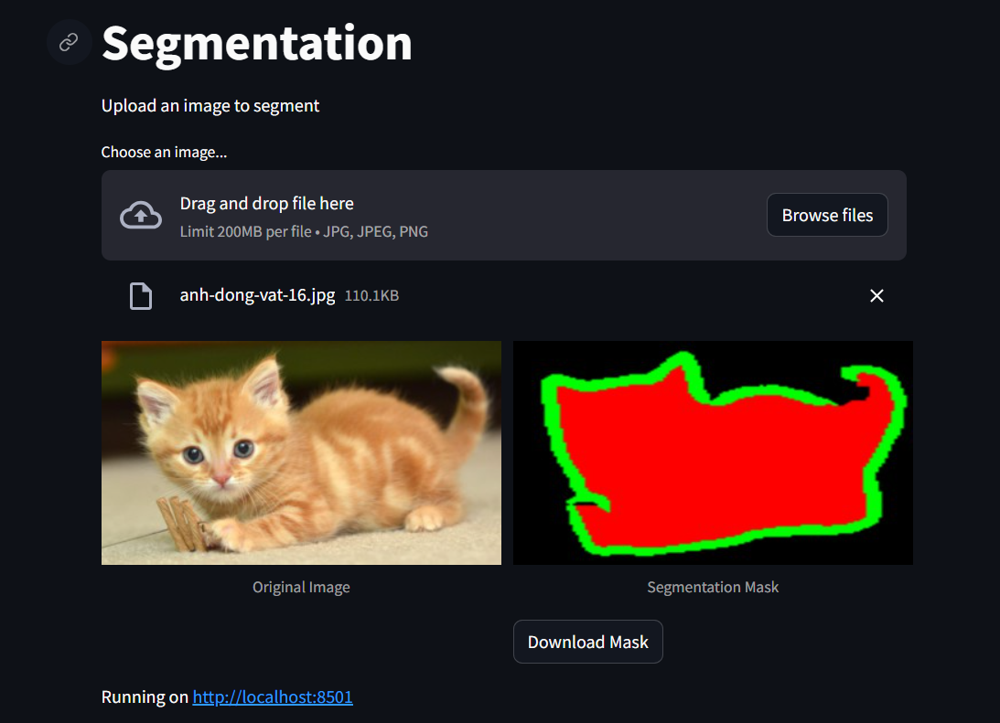
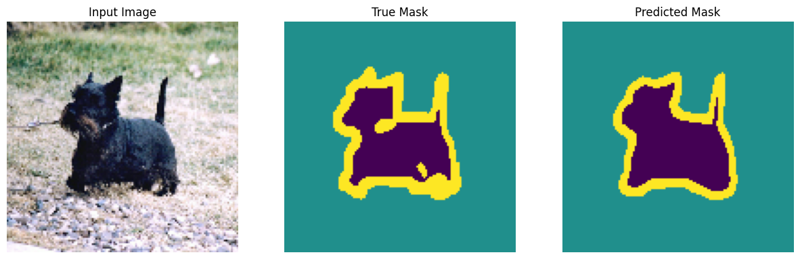
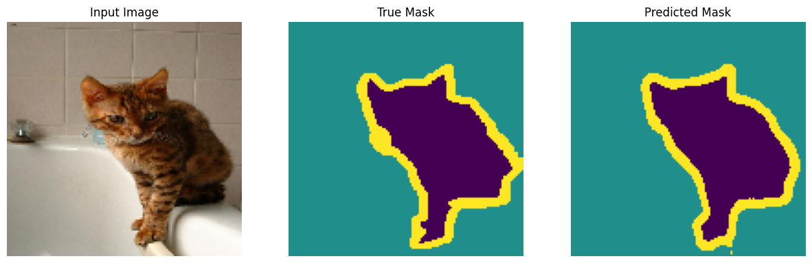
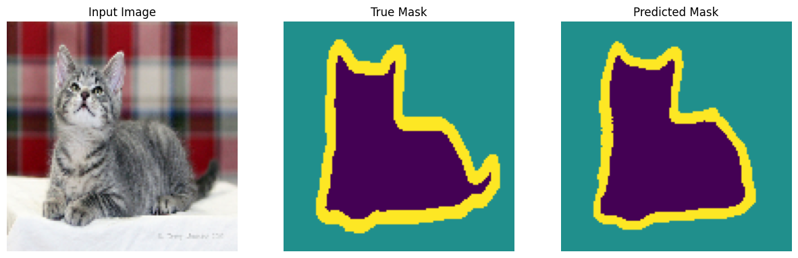
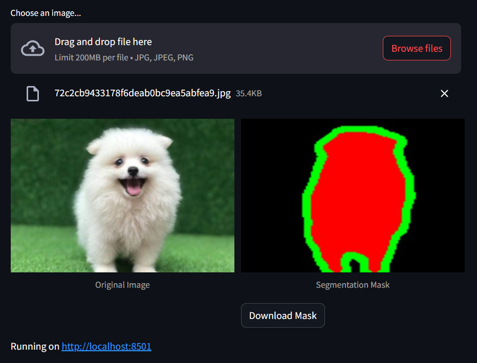
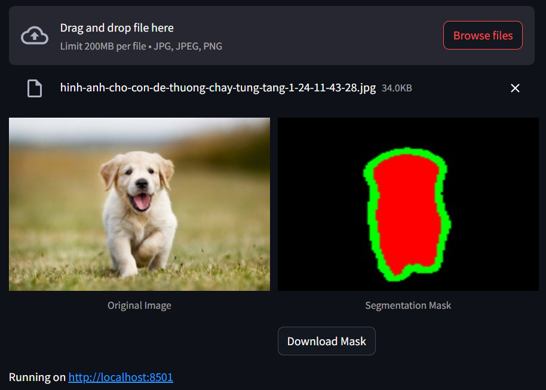
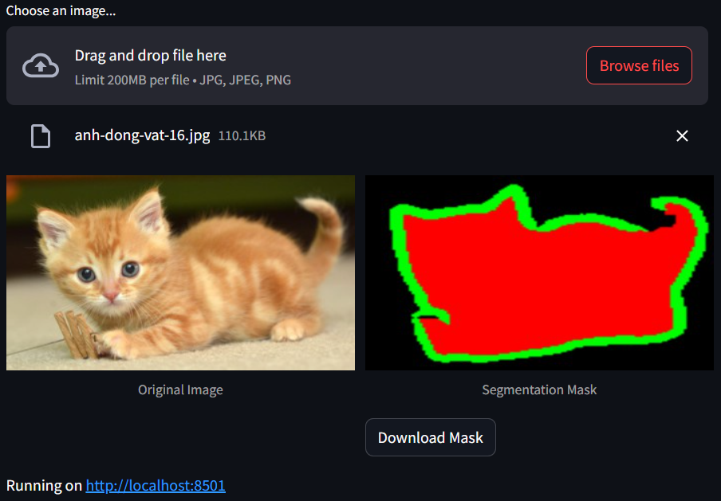
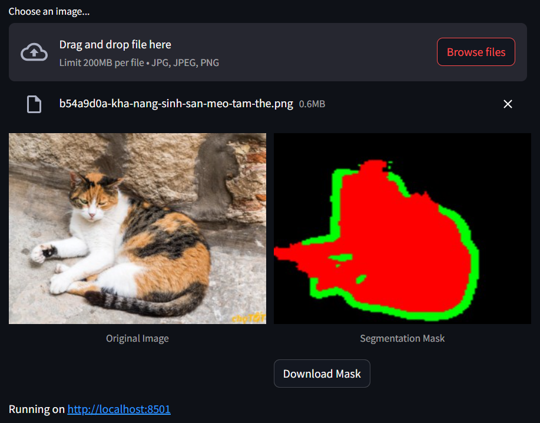

# **UNet Segmentation - Oxford IIIT Pet Dataset**

This project implements the UNet model to segment pet images from the "oxford_iiit_pet" set on TFDS. The goal is to distinguish pets, background, and borders, with applications in image processing and deep learning.

## Dependencies
- TensorFlow Datasets (TFDS) 4.9.3
```bash
pip install tensorflow-datasets==4.9.3
```

## Repository structure
```
├───input
│   │───(image test)
│   │───...
├───output
│   ├───(results)
│   ├───...
├───UNet_Segmentation.ipynb
├───app.py
└───README.md
```

### Description:
- Dataset: Oxford IIIT Pet Dataset
    + The dataset contains images of 37 dog and cat breeds (25 dogs and 12 cats).
    + Each image has a corresponding segmentation mask, which contains information about its background, pet, and borders.
    + Loaded automatically from tensorflow_datasets.
- UNet_Segmentation.ipynb: Reads and processes images to create a dataset, builds a UNet model, and then trains the model for image segmentation.
- app.py: Build a web app to test the model with streamlit.

### Usage
1. Clone the repository
```bash
git clone https://github.com/quan131/Unet_PetSeg.git
```
2. Data processing and model training: UNet_Segmentation.ipynb - you can upload this file to Google Colab and run it. Then save the checkpoint file to your local machine to use "app.py".
3. Test the model: app.py - You can run the web app to test the model using images.
```bash
streamlit run app.py
```
### DEMO
1. The web app interface will be as follows:



- Main functions of the web app:
    + Upload images for segmentation.
    + Display the original image and the segmentation mask.
    + Download the created mask.

2. Test images in the test dataset and compare them with the original labels:





3. Test images on the web app with user-selected images:

- Good images segmentation:




- Poor images segmentation:
